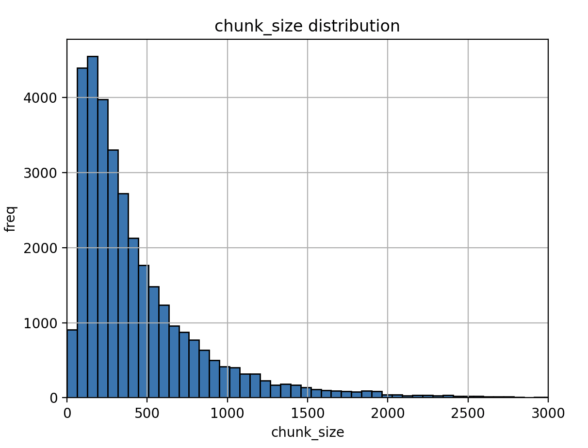
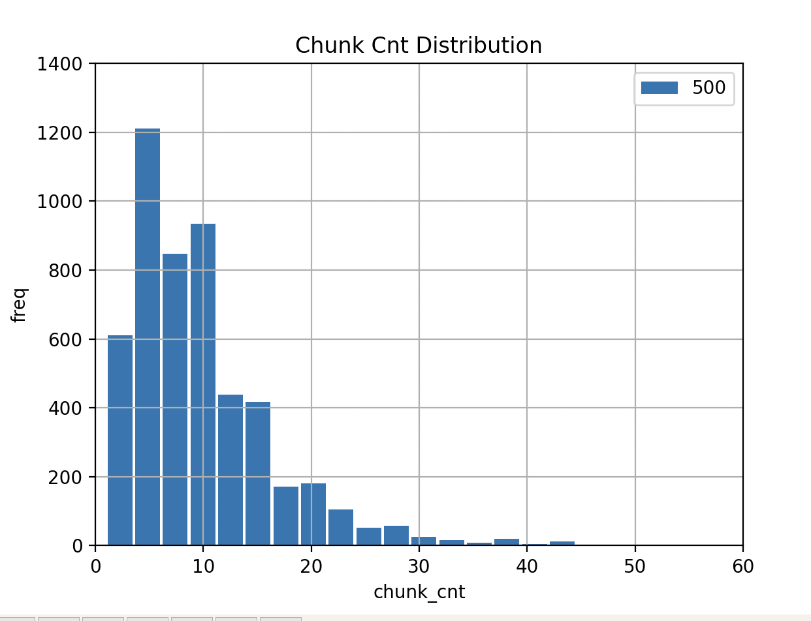
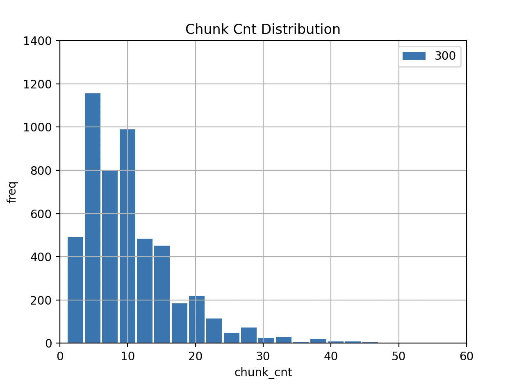
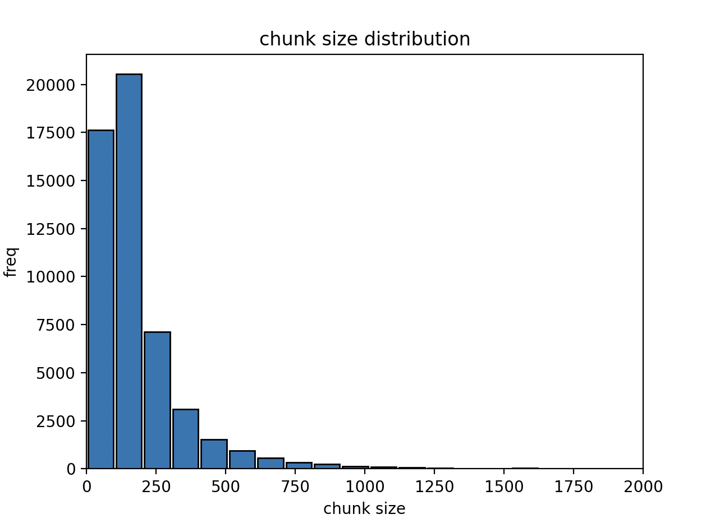
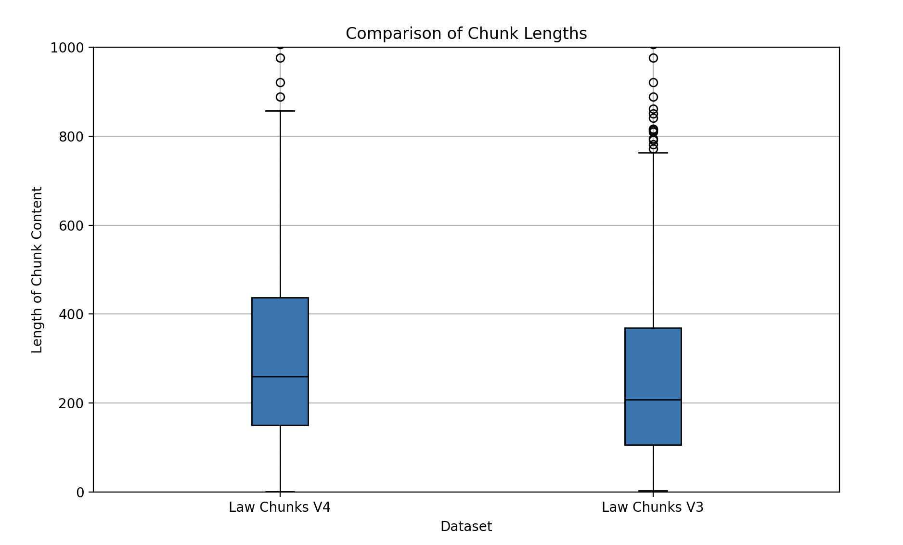
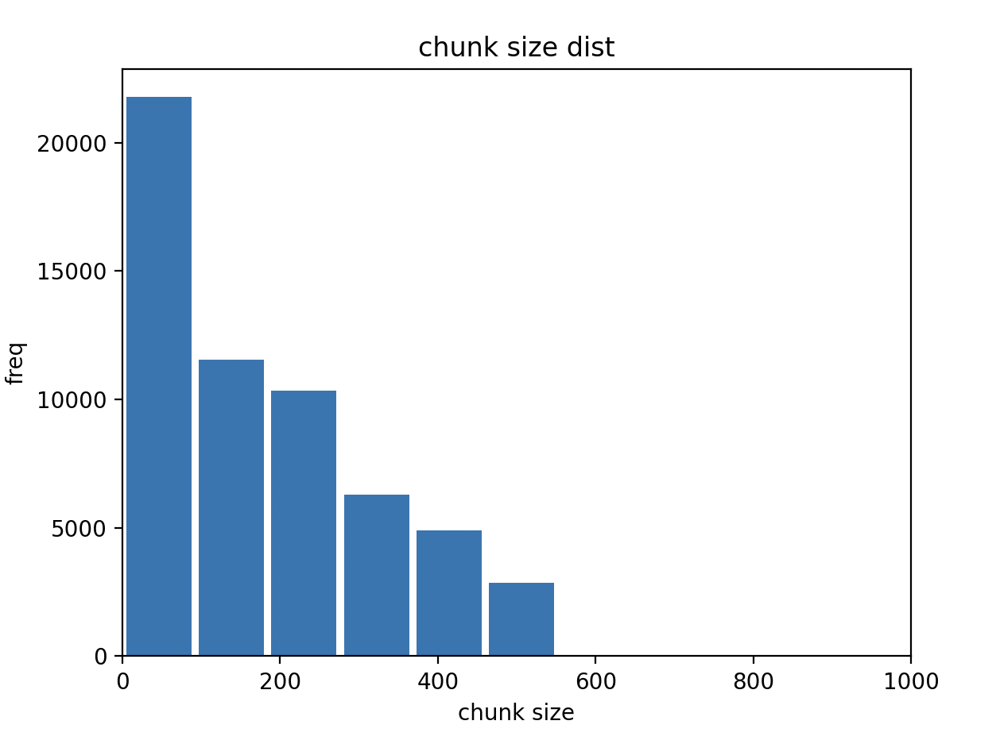

# 📊 [Law Data] 비정형 텍스트 데이터 구조화

## 1. 프로젝트 개요

* **개요:** 
    ```
    방대한 양의 생활법령 텍스트 데이터는 사용자가 원하는 정보를 정확하게 찾기 어려운 비정형 구조를 가지고 있었습니다. 이 문제를 해결하기 위해, 데이터 기반 분석을 통해 텍스트의 구조를 체계화하고, 정보를 의미 있는 단위(Chunk)로 최적화하여 서비스의 정보 검색 정확성과 사용자 경험을 개선하는 것을 목표로 삼았습니다. 본 프로젝트는 Raw 데이터를 분석하여 문제를 정의하고, 논리적인 해결 방안을 설계 및 구현하는 전 과정을 포함합니다.
    ```

* **프로젝트명:** 법령 데이터 Chunking 및 분석
* **목표:** 비정형 법령 데이터를 구조적으로 분리하고, 데이터 기반의 효율적 검색 및 분석을 가능하게 하는 로직 개발
* **역할:** 데이터 구조 분석, 청킹 로직 설계·구현, 데이터 분포 분석 및 시각화

    - _Raw 데이터 분석 및 문제 정의:_ 원본 텍스트 데이터의 길이 분포를 분석하고 시각화하여, 기존 방식으로는 서비스 활용에 적합하지 않다는 문제점을 명확히 정의
    - _데이터 구조화 로직 설계:_ 데이터의 잠재적 구조(HTML 태그 기반의 s1, s2, s3 등)를 파악하고 , 이를 활용하여 텍스트를 의미 있는 정보 단위로 재구성하는 규칙 기반의 청킹(Chunking) 로직을 설계
    - _데이터 정제 및 가공:_ 다양한 케이스(단일 문단, 복합 문단, 표, 참조 등)에 대응할 수 있도록 청크 유형을 체계적으로 분류하고 , 각 유형에 맞는 처리 방식을 구현하여 데이터 정제의 퀄리티 향상
    - _지표 기반 알고리즘 최적화:_ 텍스트의 가독성과 정보의 응집도를 고려하여, 청크 분할 기준이 되는 글자 수를 700자로 설정

---

## 2. 문제 정의

* 법령 데이터는 HTML 기반이지만 문단(tag) 단위가 불규칙하여, 그대로는 검색·분석·의사결정 지원에 활용하기 어려움
* **문제점**

  * 초기 데이터는 소제목(title) 하나에 여러 문장이 리스트 형태로 포함되어 있어, 내용 전체를 단일 정보로 보기에는 길이가 길고 비효율적
  * 소제목별 텍스트 글자 수의 누적 분포 그래프를 분석한 결과, 상당수의 데이터가 사용자가 한 번에 소비하기에 긴 텍스트 길이를 가지고 있음을 확인하고 데이터 분할(Chunking)의 필요성을 도출
  * 테이블, reference 등 특수 구조 데이터의 처리 어려움
* **핵심 과제:**
  → 데이터를 체계적으로 청킹하여 “의미 있는 최소 단위”로 나누고, 분석 및 시각화가 가능한 형태로 정제

---

## 3. 데이터 수집 및 전처리

* **데이터 출처:** 생활법령 데이터(책자형 법령 사이트 크롤링)
* **처리 과정**

  1. HTML 구조 기반 크롤링 (doc\_id, full\_title, doc\_title, content 추출)
  2. 태그(s1, s2, s3, s4, table, reference) 기반 구조 분석
  3. Raw text 분포 분석 → 글자수 700 기준으로 적정 chunk size 도출

---

## 4. EDA

* **초기 데이터 특성 분석**

    - **텍스트 길이 분포:** 원본 데이터를 분석한 결과, 평균 텍스트 길이는 460자였으나 최대 12,660자에 달하는 등 문서별 편차가 매우 큼. 특히 길이가 700자를 초과하는 문서가 다수 존재하여 LLM의 토큰 제한 및 비용 문제를 발생 가능
    - **내용 없는(Empty) 데이터 식별:** content 필드가 비어있는 경우가 존재
        - 내용이 이미지 또는 표(Table)로만 구성된 경우 
        - 텍스트가 `<출처: 도로교통공단>`과 같은 출처나 캡션 정보만 포함하는 경우

* **텍스트 길이 분포 분석**

  * 각 문단(s3 단위)의 글자 수 분포
    
    - describe 
        ```
                chunk_len
        count  33720.000000
        mean     460.440985
        std      487.531709
        min        1.000000
        25%      170.000000
        50%      312.000000
        75%      574.000000
        max    12660.000000
        ```

  * 평균·중앙값·최대값을 통해 chunk 기준(700자)의 타당성 설명

* **문서 단위 텍스트 구조 분석**

  * 한 문서(doc\_id) 당 chunk 개수 분포 시각화
    * chunk 기준(500자)
        
        - describe
            ```
                        counts
            count  5126.000000
            mean      9.926258
            std       7.391889
            min       1.000000
            25%       5.000000
            50%       8.000000
            75%      13.000000
            max     129.000000
            ```
    * chunk 기준(300자)
        
        - describe
            ```
                        counts
            count  5126.000000
            mean     10.472688
            std       7.616871
            min       1.000000
            25%       6.000000
            50%       9.000000
            75%      13.000000
            max     129.000000
            ```

  * 극단적으로 긴 문서와 짧은 문서 비교 → 예외 처리 전략 제시

* **키워드 분석(선택 사항)**

  * 텍스트 클라우드나 상위 n-gram 빈도 분석 → 주제별 데이터 특성 파악
  * 법령 데이터 특성상 주요 법률 용어와 빈도 기반 insight 제공

---

## 5. 청킹 로직 설계

* 데이터가 크롤링된 HTML 구조(s1: 대제목, s2: 소제목, s3: 내용, s4: 하위 내용 등)를 가지고 있다는 점에 착안하여, 이 태그들을 기준으로 데이터를 구조화하는 로직을 개발

* **Chunk Title 생성**: 사용자의 정보 탐색 편의성을 높이기 위해, s1과 s2 태그를 조합하여 각 청크의 제목(chunk_title)을 자동으로 생성

* **청크 유형 정의**

  * `s3` 단독 / `s3 + s4` / `s3 + reference` / `s3 + table` 조합
* **처리 규칙**

  * **기본 유형:** 내용(s3)이 하나이거나 여러 개일 경우, 글자 수(700자 기준)에 따라 청크를 통합하거나 분리하여 정보의 완결성을 유지
  * **복합 유형:** 내용(s3)과 하위 내용(s4), 참조(reference), 표(table)가 함께 있는 복잡한 구조의 경우, 각 요소를 의미적으로 연결하고 내용의 길이에 따라 분할하여 일관된 데이터 구조
    * reference → s3로 치환 후 하위 구조로 정리
    * table 데이터는 table\_id 부여 후 본문과 연결
* **개선 사항**

    * **로직 개선:** 참조(reference) 데이터 처리 시, 내용이 과도하게 분리되는 문제를 발견하고, 태그 치환 규칙을 재설정하여 의미 단위에 맞게 청크가 생성되도록 로직을 개선
        * reference 중복 태그 문제 → s8 치환 규칙 적용으로 중복 분할 방지
        * 테이블 데이터는 설명 텍스트와 연결해 의미 단위 유지

---

## 6. 분석 및 시각화

* chunking 전 전체 데이터 분포 확인
    - 소제목을 기준으로 내용을 묶었을 때, 내용의 길이 분포 그래프

    
    - describe
    
        ```
                        len
        count  42909.000000
        mean     227.689622
        std      244.863040
        min        0.000000
        25%      101.000000
        50%      155.000000
        75%      261.000000
        max    10169.000000
        ```

* Chunking 후 결과물 검증 (예시 청크 결과 첨부)
    - `law_chunks_v4`: 800자 기준으로 cut / `law_chunks_v3`: 700자 기준으로 cut
    

    - 700자 기준 chunking 후 cnt 분포 그래프
    

* 결과적으로 **의미 있는 최소 단위 문서(Chunk)** 생성 → 검색, QA, 추천 등 다양한 분석 파이프라인에 활용 가능

---

## 7. 성과 및 인사이트

* 비정형 데이터 → 구조 기반 정형 데이터로 변환 성공
* 청킹 로직 자동화를 통해 **데이터 검색 속도 개선 및 QA 정확도 향상 기대**
* 모바일 서비스 고객 로그 분석·정제와 유사한 과정으로,
  **Raw Data → 정제 → 지표화 → 인사이트 도출**의 경험을 축적

---

## 8. 프로젝트 결과 🗂️

* **[데이터 청킹 결과 PDF](https://github.com/ahyun39/Engineer/blob/main/ML/RAG/law_data_analysis/data_chunking_result.pdf)**
* **[Github Repository](https://github.com/ahyun39/Engineer/blob/main/ML/RAG/law_data_analysis/data_chunking_logic.py)**
