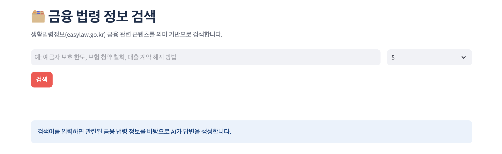
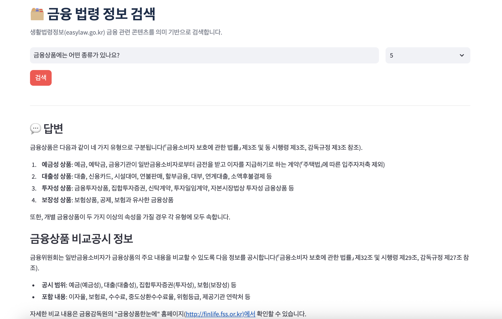
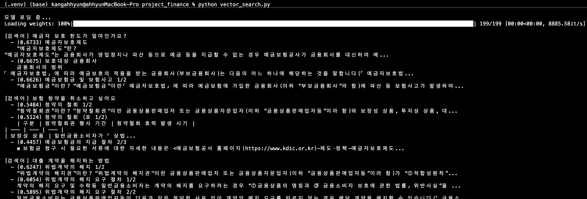

# 금융 법령 정보 검색 시스템 (RAG)

생활법령정보(easylaw.go.kr)의 금융 관련 법령 콘텐츠를 의미 기반으로 검색하고, AI가 답변을 생성하는 RAG(Retrieval-Augmented Generation) 시스템입니다.

<br>

## 화면 구현



### 질문 결과



<br>

## 유사도 기반 문서 검색



- 199개 벡터로 FAISS 인덱스 구축 완료
- 테스트 쿼리 3개("예금자 보호 한도", "보험 청약 취소", "대출 계약 해지") 실행
- 각 결과에 코사인 유사도 점수(0.67, 0.56 등)와 함께 상위 청크 반환

<br>

## 주요 기능

- **의미 기반 검색**: 키워드 매칭이 아닌 벡터 유사도(코사인 유사도) 기반 검색
- **AI 답변 생성**: Upstage Solar Pro2 LLM을 활용한 문맥 기반 답변 생성
- **원본 자료 출처 표시**: 답변 근거가 된 법령 원문 청크를 유사도 점수와 함께 표시
- **검색 결과 수 조절**: 3 / 5 / 10건 선택 가능

<br>

## 기술 스택

| 구성 요소 | 기술 |
|-----------|------|
| 데이터 수집(크롤링) | requests, BeautifulSoup4 |
| 임베딩 모델 | [jhgan/ko-sroberta-multitask](https://huggingface.co/jhgan/ko-sroberta-multitask) |
| 벡터 DB | FAISS (IndexFlatIP) |
| LLM | Upstage Solar Pro2 |
| 웹 UI | Streamlit |

<br>

## 데이터 파이프라인

```
crawling → law_data
      ↓
[EDA: text_eda]
      ↓
chunking → chunks
      ↓
embedding → embeddings + chunks_meta
      ↓
vector_search → faiss_index
      ↓
app
```

### 파이프라인 단계별 설명

1. **크롤링** (`crawling.py`): easylaw.go.kr에서 금융 법령 콘텐츠 수집 → `law_data.json`
2. **EDA** (`text_eda.ipynb`): 텍스트 길이 분포 분석으로 청킹 파라미터 결정
3. **청킹** (`chunking.py`): 법령 섹션을 적절한 크기의 청크로 분할 → `chunks.json`
   - 목표 크기: 500자, 최대 크기: 700자, 최소 크기: 100자
   - 표(table)는 마크다운 형식으로 별도 청크 생성
4. **임베딩** (`embedding.py`): 한국어 특화 모델로 청크 벡터화 → `embeddings.npy`, `chunks_meta.json`
5. **인덱스 구축** (`vector_search.py`): FAISS 인덱스 생성 → `faiss_index.bin`
6. **서비스** (`app.py`): Streamlit 검색 앱 실행

<br>

## 설치 및 실행

### 패키지 설치

```bash
pip install streamlit sentence-transformers faiss-cpu numpy openai beautifulsoup4 requests
```

### 환경변수 설정

```bash
export UPSTAGE_API_KEY="your-upstage-api-key"
```

### 사전 생성 파일 확인

앱 실행 전 아래 파일이 있어야 합니다.

```
project_finance/
├── data/
│   └── chunks_meta.json     # 청크 메타정보
└── index/
    └── faiss_index.bin      # FAISS 인덱스
```

파일이 없다면 프로젝트 루트(`project_finance/`)에서 파이프라인을 순서대로 실행

```bash
python src/crawling.py      # 데이터 수집
python src/chunking.py      # 청킹
python src/embedding.py     # 임베딩 생성
python src/vector_search.py # 인덱스 구축
```

### 앱 실행

```bash
streamlit run app.py
```

<br>

## 파일 구조

```
project_finance/
├── app.py               # Streamlit 메인 앱 (진입점)
├── README.md
├── src/                 # 파이프라인 스크립트
│   ├── crawling.py      # easylaw.go.kr 크롤러
│   ├── chunking.py      # 텍스트 청킹 모듈
│   ├── embedding.py     # 벡터 임베딩 생성
│   └── vector_search.py # FAISS 인덱스 구축 및 검색
├── data/                # 원본 및 처리 데이터
│   ├── law_data.json        # 원본 크롤링 데이터
│   ├── text_sections.json   # 섹션 단위 정제 텍스트
│   ├── chunks.json          # 청킹된 텍스트
│   └── chunks_meta.json     # 임베딩 메타정보
├── index/               # 벡터 인덱스 파일
│   ├── embeddings.npy       # 벡터 임베딩 배열
│   └── faiss_index.bin      # FAISS 인덱스
├── notebook/            # EDA 분석 노트북
│   └── text_eda.ipynb       # 텍스트 길이 분포 EDA
└── image/               # UI 스크린샷
```

<br>

## 검색 예시

- `예금자 보호 한도가 얼마인가요?`
- `보험 청약을 취소하고 싶어요`
- `대출 계약을 해지하는 방법`

<br>

## 주의사항

- 이 시스템은 **정보 제공 목적**이며, 법률 자문을 대체하지 않습니다.
- `UPSTAGE_API_KEY`가 없을 경우 AI 답변 없이 검색 결과만 표시됩니다.
- 데이터 출처: [국가법령정보센터 생활법령정보](https://www.easylaw.go.kr)
