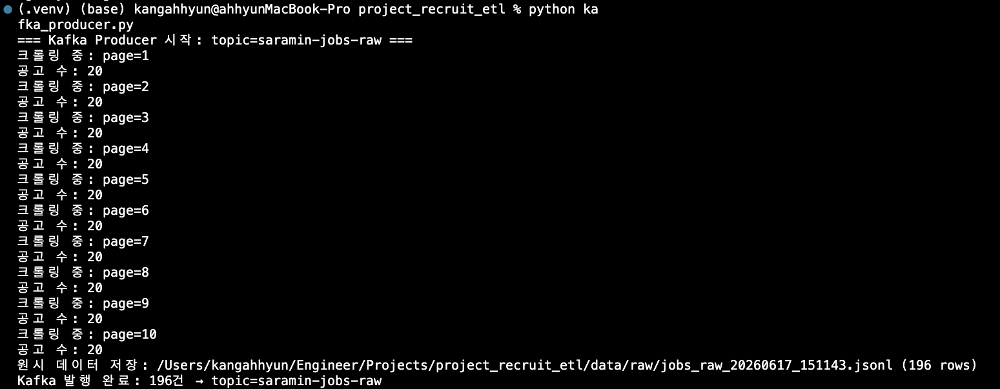
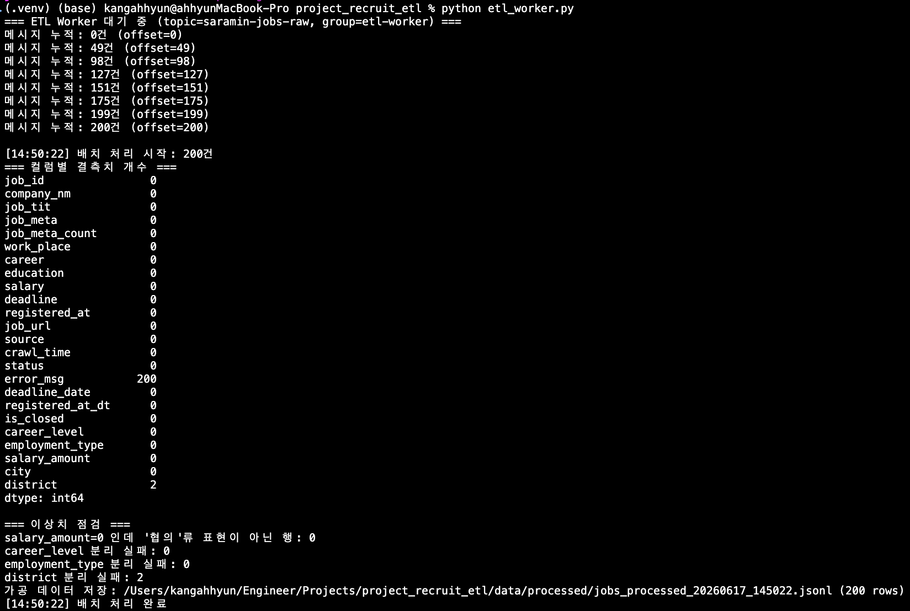
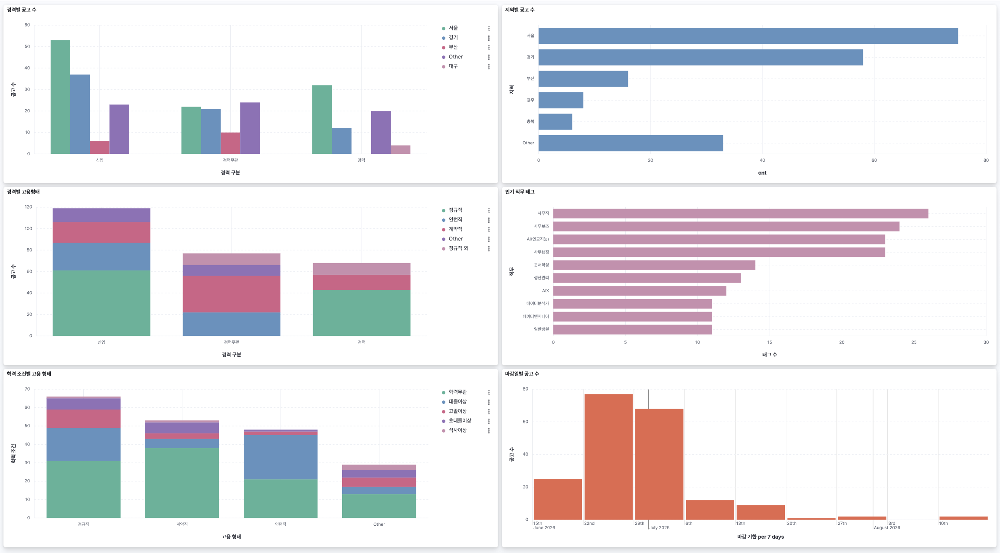
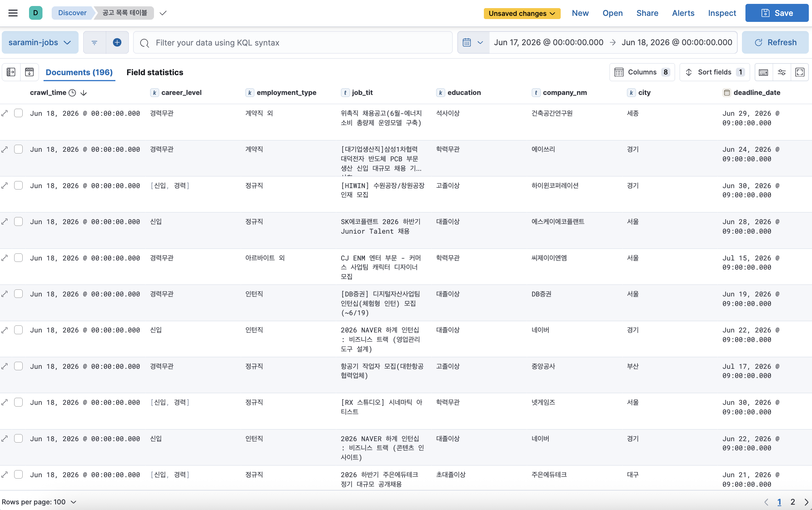

# 채용 공고 ETL 파이프라인

사람인 채용 공고를 수집·정제해 Elasticsearch에 적재하고, Kibana 대시보드로 시각화하는 배치 ETL 파이프라인입니다.

## Architecture

```
[crontab 11:00, 18:00]
         │
         ▼
  kafka_producer.py          Extract: 사람인 10페이지 크롤링 → raw JSONL 저장
         │                            ↓
         │              Kafka Topic: saramin-jobs-raw
         │                            ↓
  etl_worker.py (상시 실행)   Transform: 날짜 파싱·텍스트 정제·구조화 → processed JSONL 저장
         │                            ↓
         └──────────────────►  Elasticsearch: saramin-jobs 인덱스 (bulk upsert)
                                        ↓
                               Kibana Dashboard
```

## Tech Stack

| 영역 | 기술 |
|------|------|
| 크롤링 | Python, requests, BeautifulSoup |
| 메시지 큐 | Apache Kafka 3.7.0 (KRaft 모드, Docker) |
| 저장소 | Elasticsearch 8.13.0 (Docker) |
| 시각화 | Kibana 8.13.0 (Docker) |
| 스케줄링 | macOS crontab (하루 2회) |
| 데이터 처리 | pandas, kafka-python-ng |

## 프로젝트 구조

```
project_recruit_etl/
├── scraper.py          # Extract: 사람인 크롤링 모듈
├── transformer.py      # Transform: 정제·파생 컬럼 생성 모듈
├── loader.py           # Load: Elasticsearch 적재 모듈
├── kafka_producer.py   # cron 진입점 — scrape() 후 Kafka 토픽에 publish
├── etl_worker.py       # Kafka Consumer — 배치 누적 후 transform → load
├── docker-compose.yml  # Kafka / Elasticsearch / Kibana 서비스 정의
├── data/
│   ├── raw/            # jobs_raw_YYYYMMDD_HHMMSS.jsonl
│   └── processed/      # jobs_processed_YYYYMMDD_HHMMSS.jsonl
├── images/             # README 및 record.ipynb 스크린샷
├── logs/               # cron 실행 로그
└── record.ipynb        # 개발 과정 기록 노트북
```

## 실행 방법

### 1. 사전 준비

```bash
# Python 의존성 설치
pip install requests beautifulsoup4 pandas kafka-python-ng elasticsearch

# Docker로 인프라 실행
docker compose up -d
```

### 2. 수동 실행

```bash
# ETL Worker 실행 (상시 대기 — 별도 터미널)
python etl_worker.py

# 크롤링 → Kafka 발행 (또 다른 터미널)
python kafka_producer.py
```

Worker가 메시지를 수신하면 30초 idle 후 자동으로 Transform → Load를 수행합니다.

### 3. cron 자동 실행 등록

```bash
crontab -e
```

```crontab
0 11 * * * cd /path/to/project_recruit_etl && /opt/anaconda3/bin/python3 kafka_producer.py >> logs/cron.log 2>&1
0 18 * * * cd /path/to/project_recruit_etl && /opt/anaconda3/bin/python3 kafka_producer.py >> logs/cron.log 2>&1
```

### 4. Kibana 접속

브라우저에서 `http://localhost:5601` 접속 → **Stack Management → Data Views → Create data view**
- Index pattern: `saramin-jobs`
- Timestamp field: `crawl_time`

## 데이터 스키마

### Raw (Extract 결과)

| 컬럼 | 설명 |
|------|------|
| `job_id` | 공고 고유 ID (rec_idx) |
| `company_nm` | 회사명 |
| `job_tit` | 공고 제목 |
| `job_meta` | 직무 태그 (리스트) |
| `work_place` | 근무지 |
| `career` | 경력·고용형태 원문 |
| `education` | 학력 조건 원문 |
| `salary` | 급여 원문 |
| `deadline` | 마감일 원문 |
| `registered_at` | 등록일 원문 |

### Processed (Transform 결과, +파생 컬럼)

| 파생 컬럼 | 변환 내용 |
|-----------|----------|
| `deadline_date` | `D-N`, `~MM.DD`, `오늘/내일마감` → `date` |
| `registered_at_dt` | `N분/시간/일 전` → `datetime` |
| `is_closed` | 마감일 기준 마감 여부 `bool` |
| `career_level` | `신입·경력·경력무관` 리스트 |
| `employment_type` | `정규직·계약직·인턴직` 리스트 |
| `salary_amount` | `N만원` → 원 단위 정수 |
| `city` / `district` | 근무지 시·도 / 시·군·구 분리 |

Elasticsearch 색인 시 `job_id`를 `_id`로 사용해 **재수집 시 중복 없이 upsert** 됩니다.

## 실행 결과

### Kafka Producer / ETL Worker





### Kibana Dashboard



경력별 공고 수, 지역별 분포, 고용형태 비중, 인기 직무 태그, 학력 조건, 마감일 현황을 한 화면에서 확인할 수 있습니다.


